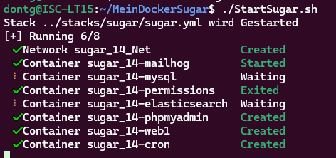

# Allgemeine Info
# Anlegen einer Neuen Sugar Docker Instanz

```
mkdir MeinDockerSugar
cd MeinDockerSugar
git clone ssh://gitea@172.16.8.129:2222/ISC/SugarDockerBasis.git .
```

Festlegen der Umgebungsvariablen
kopieren Template nach variablenfile:

```
cp stacks/sugar/.template_env stacks/sugar/.env
```

Jetzt das Variablen file Bearbeiten

```
nano stacks/sugar/.env
```

Ändern: wie ihr es braucht:

STACK_NAME und BASE_NAME Rest nur bei Bedarf

| Variabele    | Beschreibung                      |
|--------------|-----------------------------------|
| STACK_NAME   | Name für den Docker Stack         |
| BASE_NAME    | prefix für alle services im Stack |
| SUGAR_PORT   | Port für zugriff von aussen       |
| MAILHOG_PORT | Port für zugriff von aussen       |
| MYADMIN_PORT | Port für zugriff von aussen       |
| MYSQL_PORT   | Port für zugriff von aussen       |

→ Speichern
anschließend passendes Template Kopieren (sugar 14 , sugar12 ...)

```
cp stacks/sugar/template_sugar14.yml stacks/sugar/sugar.yml
```

# Befehle Start /Stop / xdebug

Damit ist die Konfiguration abgeschlossen.
Hier die wichtigsten Befehle:

| Befehl           | Beschreibung         |
|------------------|----------------------|
| ./StartSugar.sh  | Stack Starten        |
| ./StopSugar.sh   | Stack herunterfahren |
| ./StartXdebug.sh | XDebug activieren    |
| ./StopXdebug.sh  | XDebug Beenden       |


# Installation von Sugar aus Zipfile
Die Installation von Sugar selbst
(Zuerst muss Sugarstack gestartet werden.)
```
./StartSugar.sh
```
Darauf hin wird der Stack gestarted




Sobald der Stack lauft kann über das utilities verzeichnis 
eine Basis installation eingespielt werden.
Dies geht wie folgend:
Ihr müsst das Sugar installations zip Bereithalten
und den pfad absolut angeben
```
cd utilities
./installfromzip.sh /home/dontg/SugarEnt-14.0.1.zip
```
Der Vorgang benötigt eine Weile da die Installation automatisch Demodaten mit anlegt.

Das installierte Sugar liegt dann im verzeichnis
./data/app/sugar und kann dort mit PHPStorm eingebunden werden
